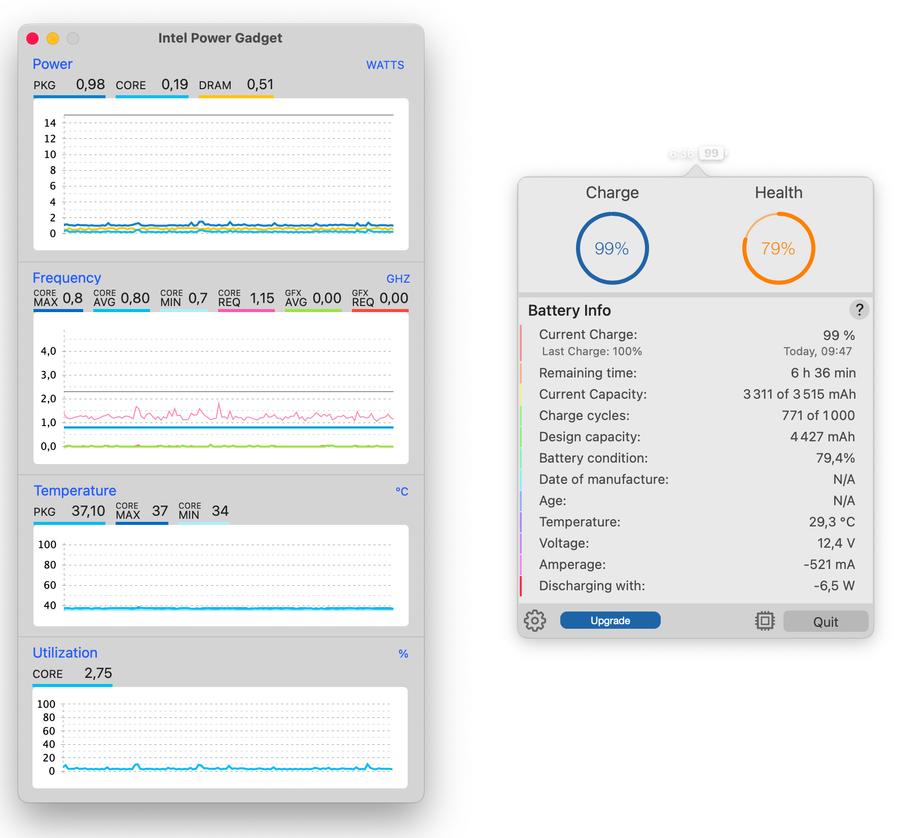
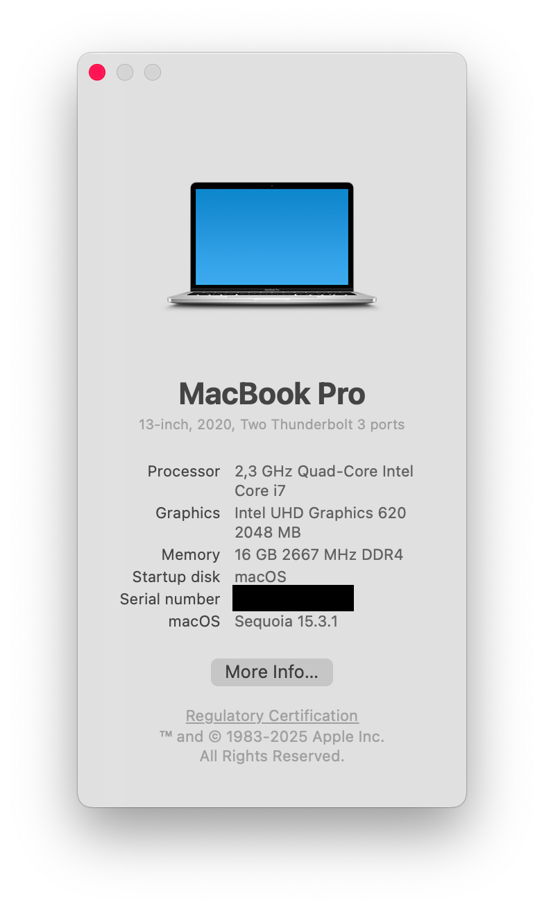

# Lenovo ThinkPad P14s/T14 Hackintosh V3

Two versions in this repository:
- DEBUG : for troubleshooting and optimizing EFI, separated SSDT
- RELEASE : for daily use, faster startup, all SSDT in one file

Dual boot with Windows / Linux is still possible but in this case, OpenCore only loads macOS, booting Windows / Linux is nevertheless possible directly from UEFI boot entries.

## Software Configuration

| Component      | Version        |
| -------------- | -------------- |
| macOS          | Sequoia 15.3.1 |
| SMBIOS         | MacBookPro16,3 |
| OpenCore       | 1.0.3          |
| BIOS           | 1.32           |

## Hardware configuration

| Category  | Component                                            | Notes
| --------- | ---------------------------------------------------- |-----------------------------------------|
| CPU       | Intel Core i7-10510U                                 |                                         |
| iGPU      | Intel UHD 620                                        |										                     |
| dGPU      | Nvidia Quadro P520                                   | Disabled via ACPI to extend battery life|
| SSD       | Samsung 980 500 Go                                   |										                     |
| Screen    | 14" FHD 1920x1080                                    |                                         |
| Memory    | 16GB / 2666MHz DDR4                                  | Battery life: ~6h30                     |
| Battery   | Integrated Li-Polymer 50Wh                           | 										                     |
| Camera    | 720p Camera                                          | 										                     |
| Wifi & BT | Intel AX 201                                         | Works on Sequoia with `itlwm.kext`      |
| Input     | PS2 Keyboard                                         | All fn-keys works                       |
| Input     | Synaptics SMBUS TrackPad                             | Multi-touch gestures 					         |
| Input     | SMBUS TrackPoint                                     | Smooth and flawlessly 					         |
| Input     | SD Card Reader                                       | 										                     |
| Input     | SmartCard Reader                                     | Disabled in BIOS to extend battery life |
| Input     | Fingerprint Reader                                   | Disabled in BIOS to extend battery life |
| Audio     | Realtek ALC 257 (aka ALC3287)                        | 								                         |

## Status

<strong>Working ✅</strong>

- [x] Battery readings
- [x] Fan speed control + sensors
- [x] Bluetooth - Intel Wireless AX201 
- [x] Wifi - Intel Wireless AX201
- [x] CPU power management (~1 W at IDLE)
- [x] iGPU UHD hardware acceleration / performance 
- [x] iServices
- [x] Sleep/Wake 
- [x] TouchPad  
- [x] TrackPoint  
- [x] Keyboard 
- [x] Speaker
- [x] Jack 3.5 (speaker + microphone)
- [x] Sleep/Wake 
- [x] USB Ports 
- [x] Camera
- [x] SD Card Reader 
- [x] Backlit keyboard
- [x] External display over HDMI

<strong>Not working ⚠️</strong>

- [ ] Internal microphone (Intel SST incompatibility with macOS)
- [ ] Airdrop (native network card needed)
- [ ] Fingerprint reader (didn't work on Hackintosh)

<strong>Untested</strong>

- [ ] USB-C External display
- [ ] Audio over HDMI
- [ ] SmartCard Reader
- [ ] TB3
- [ ] Safari DRM
- [ ] Sidecar

<strong>Problems</strong>

- No HDMI output after wake
- Smooth brightness change
- Set stop for the lowest backlight value to prevent the screen from being without backlight
- Bluetooth currently disabled need furthermore investigation

## SSDT Patches

| SSDT             | Note                                    |
| ---------------- | --------------------------------------- |
| SSDT-AC          | Device naming (cosmetic)                |
| SSDT-ALS0        | Fake Ambiant Light Sensor               |
| SSDT-ARTC        | Fix system clocks                       |
| SSDT-BAT0        | Fix battery reading                     |
| SSDT-DGPU        | Disable dedicated GPU                   |
| SSDT-DMAC        | Adds (DMA) to the LPCB.		             |
| SSDT-ECRW        | Enable EC Read and Write                |
| SSDT-GAUS        | Device naming (cosmetic)                |
| SSDT-GPRW        | Fix sleep/wake ?                        |
| SSDT-INIT        | Set variables for macOS + Voodoo config |
| SSDT-KBRD        | Fix fn-keys                           	 |
| SSDT-MCHC        | Fix SMBus support                   	   |
| SSDT-PMCR        | Device naming (cosmetic)              	 |
| SSDT-PNFL        | Enable backlight control             	 |
| SSDT-PWRB        | Power button                         	 |
| SSDT-SRAM        | Device naming (cosmetic)             	 |
| SSDT-TERM        | Device naming (cosmetic)             	 |
| SSDT-THBT        | ThunderBold 3                        	 |
| SSDT-UART        | Device naming (cosmetic)              	 |
| SSDT-USBX        | Supply USB power properties          	 |
| SSDT-XOSI        | Fix trackpad                          	 |
| SSDT-XSPI        | Adds Intel PCH SPI Controller         	 |

## Notes
- `ASL` (**A**CPI **S**ource **L**anguage)
- `AML` (**A**CPI **M**achine **L**anguage)

## References
- Dortania guide : https://dortania.github.io/OpenCore-Install-Guide/
- OpenCore configuration guide : https://github.com/acidanthera/OpenCorePkg/blob/master/Docs/Configuration.pdf
- OC Little translated https://github.com/5T33Z0/OC-Little-Translated/tree/main
- OC Book (CN) : https://ocbook.tlhub.cn/
- Common SSDT usage : https://elitemacx86.com/threads/common-ssdt-usage-for-macos.1182/
- X1C6 hackintosh EFI from tylernguyen : https://github.com/tylernguyen/x1c6-hackintosh/tree/main + docs : https://tylernguyen.github.io/x1c6-hackintosh/#macos-continuity
- OpenCore patching guide : https://github.com/jsassu20/OpenCore-HotPatching-Guide/tree/master
- ACPI Specifications : https://uefi.org/sites/default/files/resources/ACPI_Spec_6.5a_Final.pdf